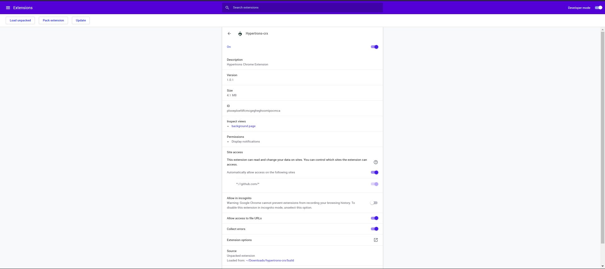

Microtask - 2
---

 > - To Remove your hypertrons-crx extension that downloaded from [Chrome Web Store](https://chrome.google.com/webstore/detail/hypertrons-crx/jkgfcnkgfapbckbpgobmgiphpknkiljm)  from Chrome (or Edge) & reinstalled it from the release.
 > -  Refer to this [guide](https://github.com/hypertrons/hypertrons-crx/blob/master/INSTALLATION.md)

--- 

---

Steps
  - Removed the earlier installed hypertrons-crx extension that is downloaded from Chrome Web Store

  - Downloaded the file hypertrons.zip from [release](https://github.com/hypertrons/hypertrons-crx/releases), and unzipped the .zip file in a directory named `hypertrons-crx`

  - Opened a New window in Chrome browser and enter chrome://extensions in the address bar directing to the extension management page.

  - Turned on the [Developer Mode] button on the top right corner of this page, then refresh.

  - Clicked [Load Unpacked] button on the top left, and select the folder where the unzipped files are stored which is present in `hypertrons-crx/build`.

  - Now, the extension can be successfully loaded. Make sure the switch is on.

---