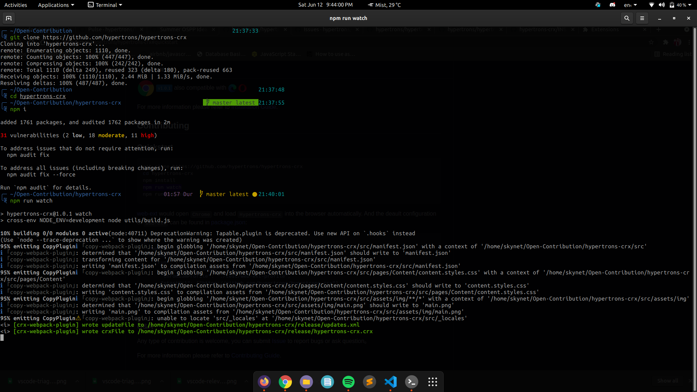
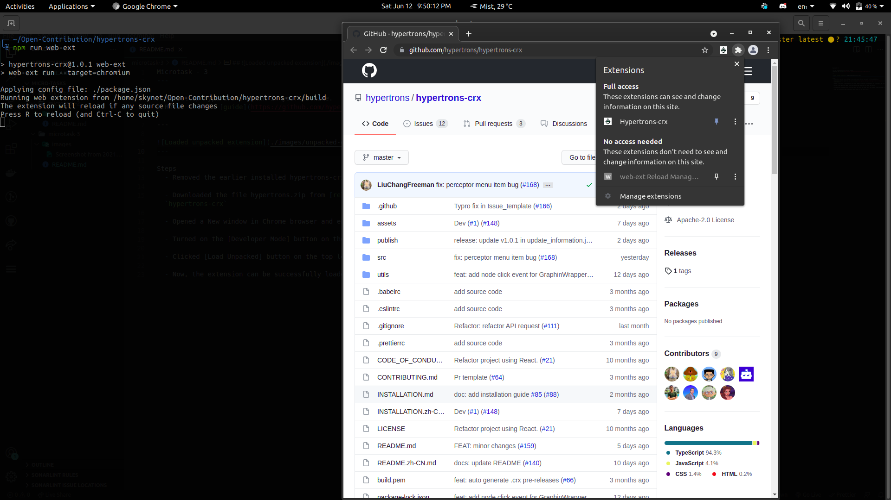

Microtask - 3
---

 > - To Set up hypertrons-crxin in your machine.
 > - Refer to this [guide](https://github.com/hypertrons/hypertrons-crx#quickstart)

--- 

---

Steps
  - Open the terminal & write `git clone https://github.com/hypertrons/hypertrons-crx` to clone the project locally in a directory named `hypertrons-crx`.

  - Change the directory to your project folder & install all the dependencies by writing this command in the terminal `npm install`.

  - After all the dependencies are installed, You can run the project in `watch` mode.
  
  - If you want to directly load the extension from the locally cloned project itself, you can run `npm run web-ext`. It will open Chrome and load Hypertrons-crx into the browser automatically. And the deault configuration of web-ext can be found in package.json

---

  
  
---